## 预备环境

- iOS 开发环境，Mac OS、XCode 11 及以上版本；
- 下载离线打包iOS版SDK（[5+ SDK下载](http://ask.dcloud.net.cn/article/103)）。
- 确保版本一致,请确保从HBuilderX导出的资源文件 的HBuilderX的版本和离线SDK发布的版本号一致，如下2张图里的版本：


**注意：如果版本不一致，app启动时会弹出版本不一致的提示框**

**注意：本文档基于XCode10 其他版本如有问题请留言**

## 离线包SDK目录说明

- HBuilder-Hello工程：包含所有模块的离线打包演示工程.
- Feature-iOS.xls文件：包含iOS平台各扩展模块和核心模块的库配置关系.
- SDK文件：包含打包工程需要的库文件，.h头文件，配置文件，资源文件等
**注意：HBuilderX运行环境相关库文件已全部包含在HBuilder-Hello演示工程中**

### 准备工程
## 新建一个Xcode工程，步骤如下：
1、打开Xcode，创建新工程，选择“Single View Application”

2、添加创建工程的名称（注意：最好不要填中文或特殊字符）
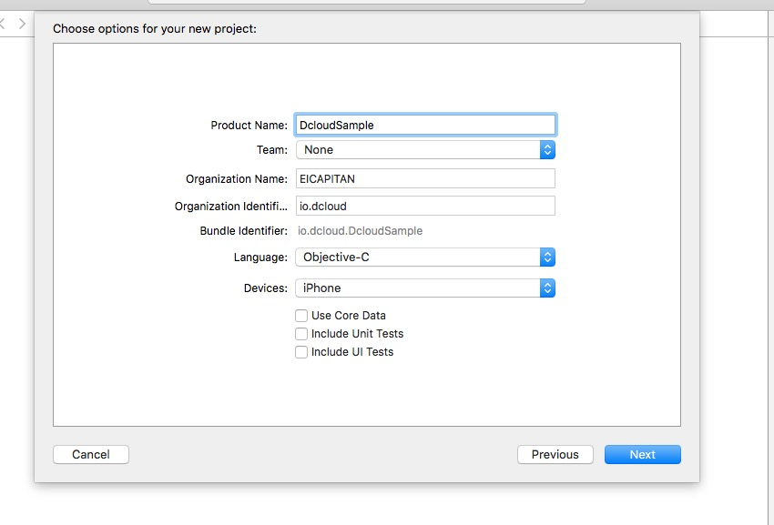


### 配置工程 
## 基础模块配置
 找到离线SDK包，并解压SDK包，进入目录，准备配置基础模块。
 
1、从离线包中的HBuilder-Hello工程里找到AppDelegate和ViewController的.h和.m文件,
然后覆盖掉刚创建的工程里的相应文件
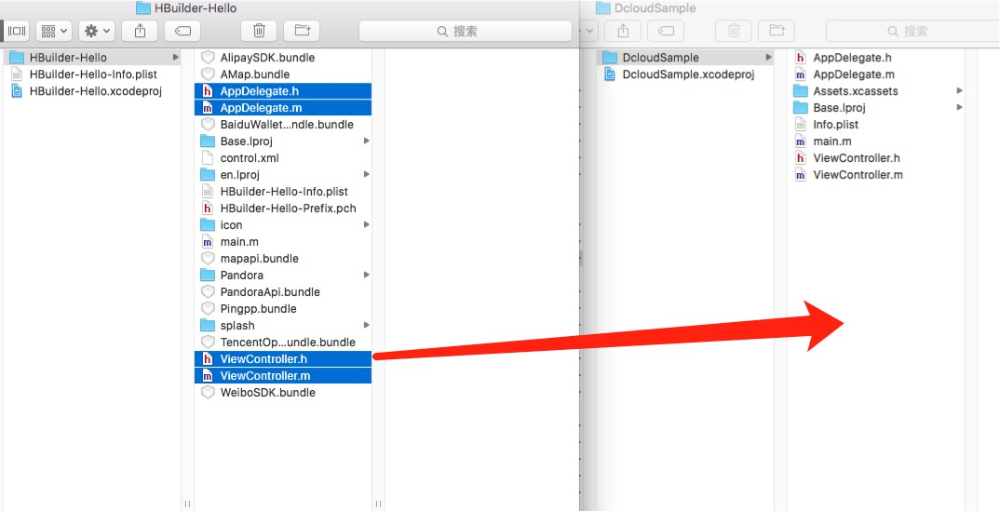
2、拷贝以下文件到新创建工程目录下
iOSSDK/SDK/Bundles/PandoraApi.bundle
iOSSDK/SDK/control.xml
iOSSDK/SDK/Libs/liblibPDRCore.a
iOSSDK/SDK/Libs/libcoreSupport.a
iOSSDK/SDK/Libs/liblibUI.a


3、添加刚才拷贝的文件到工程内

4、拷贝IOS-SDK/SDK/inc目录到新创建工程目录下，并添加到工程内
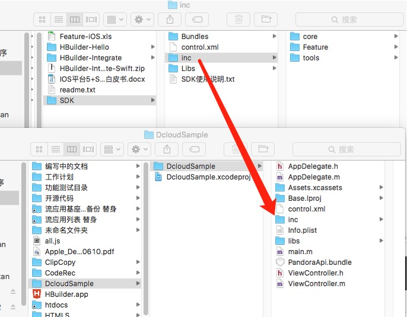
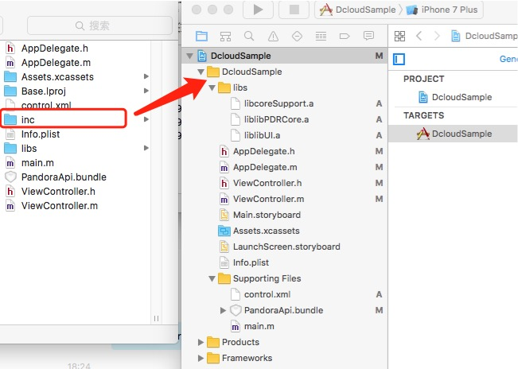


5、点击Project->TARGETS->Build Settings搜索“Other Linker Flags”，双击搜索到的项双击，在弹出框内添加想“-ObjC”
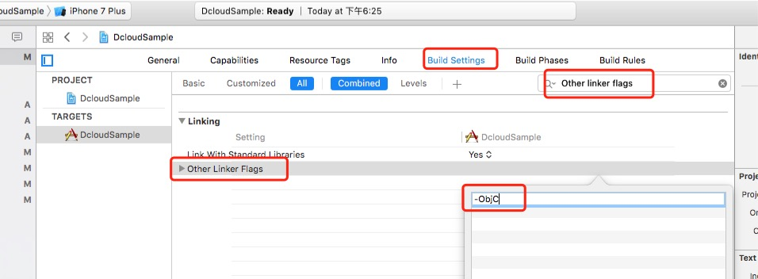
6、点击Projcet->General->Linked Frameworks and Libraries 添加系统库到工程

|  系统库 |
| :------: |
| JavaScriptCore.framework |
| WebKit.framework |
| CoreTelephony.framework |
| MobileCoreServices.framework |
| SystemConfiguration.framework |
| MediaPlayer.framework |
| AudioToolbox.framework |
| Security.framework |
| QuartzCore.framework |
| CFNetwork.framework |
| Foundation.framework |
| CoreFoundation.framework |
| CoreGraphics.framework |
| UIKit.framework |
| QuickLook.framework |
| libc++.tbd |
| libxml2.tbd |
| libz.tbd |
| libsqlite3.0.tbd |
| ImageIO.framework |
| CoreText.framework |
| Storekit.framework |
|UserNotifications   并设置为Optianal  |


7、 修改BitCode
点击Project->TARGETS->Build Settings搜索BitCode
将Enable Bitcode项的值改成 ‘NO’
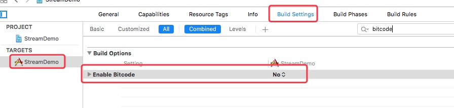

<!-- 8、点击Project->TARGETS->Build Settings搜索“ARC”，修改"Objective-C Automatic Reference Counting"项的值为"NO", 如果希望使用ARC则需要修改相应的内存管理代码。
 -->

8、 修改info.plist文件，添加App Transport Security Settings类型为Dictionary，在该项下添加Allow Arbitrary Loads项类型为Boolean，值为YES


9、编译运行，看看是否有错，没有错进入下面的配置步骤。


## 工程配置
### - 配置应用标识(Boundle Identifier)

选择左侧应用工程根目录，选中TARGETS下的HBuilder打开工程属性界面，在General下修改Identity的值：


其中,Bundle Identifier为苹果的AppID，必须与应用发布是配置的Profile关联的AppID一致；

Version为应用版本号，在App Store中显示的版本号，推荐与manifest.json中version下的name值一致；

Build为编译版本号，App Store判断升级使用，推荐与manifest.json中version下的code值一致。


###  <a id="name">- 配置应用名称 </a>

1、在打开的原生工程中，点击工程的targets和点开manifest文件，然后将manifest文件里的“name”字段的内容 和原生工程里的Display Name 的写成一样。

注意，manifest文件里的”name“ 对应的是HBuilderX打开的工程里的“基础配置”里的应用名称。如下图红色框所示：
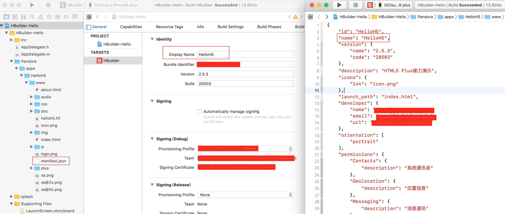


2、如果需要配置国际化，在工程导航界面，选择InfoPlist.strings文件，修改CFBundleDisplayName值为应用名字:
InfoPlist.strings(English)为英文系统应用名,Simplified为中文简体系统应用名
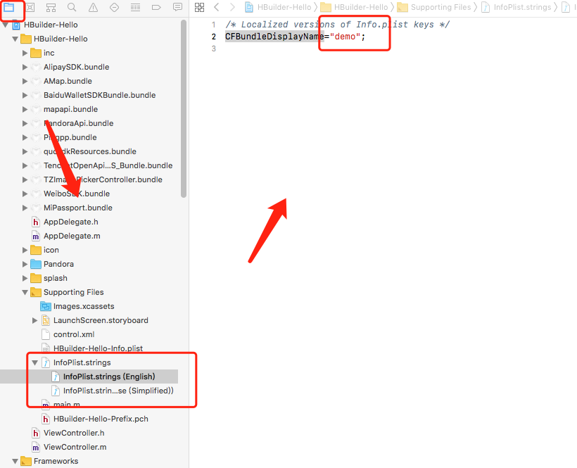


### <a id="versionname">- 配置应用版本名称 </a>
在打开的原生工程中，点击工程的targets和点开manifest文件，然后将manifest文件里的“version”字段里的“name”的内容 和原生工程里的Version 的写成一样。注意，manifest文件里的“version”字段里的“name” 对应的是HBuilderX打开的工程里的“基础配置”里的应用版本名称。如下图红色框所示：


### <a id="versioncode">- 配置应用版本号 </a>
在打开的原生工程中，点击工程的targets和点开工程里的manifest文件，然后将manifest文件里的“version”字段里的“code”的内容 和原生工程里的Build 的写成一样。注意，manifest文件里的“version”字段里的“code” 对应的是HBuilderX打开的工程里的“基础配置”里的应用版本号。如下图红色框所示：
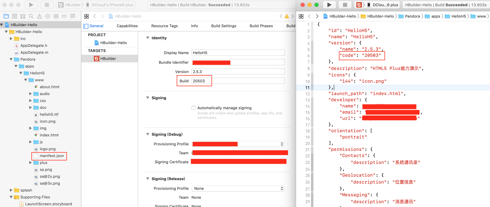


### -设置应用的图标
点击project->target->General->App Icons and Launch Images->App Icons Source项右侧小箭头
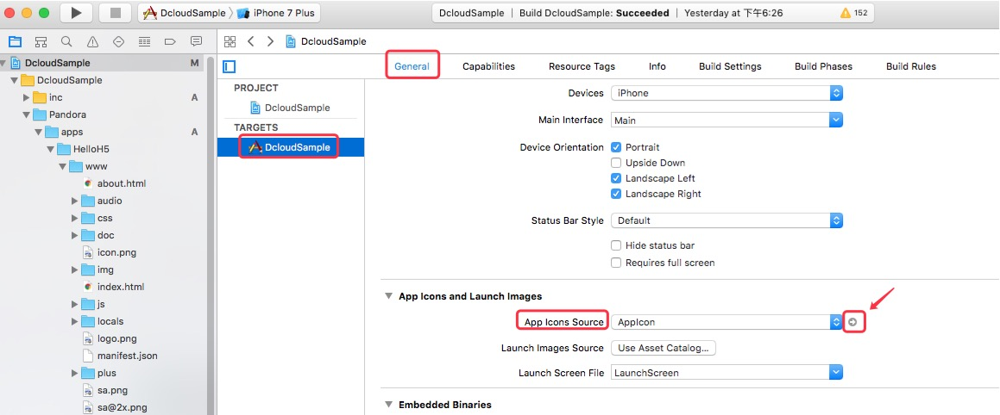
在新开页面根据提示将对应尺寸的应用图标拖入到虚线框中即可


### 配置应用启动界面
1、把工程里的LaunchScreen.storyboard 文件删掉及如下图配置的地方设置为空，这样配置之后打包工程的启动图就是splash目录里配置的启动了，就不会是LaunchScreen.storyboard 的启动图。
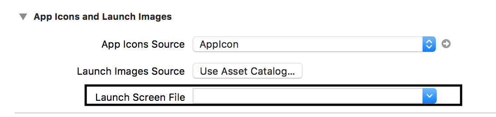

2、拷贝HBuider-Hello工程的info.plist文件的UILaunchImages节点到新工程info.plist文件，同时拷贝HBuilder-Hello工程下的splash目录到新工程目录下并将其添加到新工程中
根据图片的尺寸逐个替换splash图片，注意文件名不能修改


### <a id="channel">如何配置多渠道</a>
在需要的打包的原生工程中找到工程的配置文件-Info.plist ，然后添加marketChannel节点，节点内容格式为：包名|应用标识|广告标识|渠道 如io.dcloud.HB|appid|adid|apple

包名：对应xcode里的bundleid，如io.dcloud.HBuilder。

应用标识：对应5+或uni-app项目manifest.json中appid。

广告标识：DCloud的广告标识，开通广告后可在dev.dcloud.net.cn获取，如果没有开通广告，设置值为空即可。
渠道：可以填apple。

**注意：**如果要配置广告，需要2个步骤：
1.在info.plist文件里加DCLOUD_AD_ID节点，内容 为自己申请的广告adid
2.把marketChannel节点的广告标识换成申请的广告标识。如下图所示：


### 如何关闭广告
5+SDK里默认打开了开屏广告，用户如果不需要开屏广告可在Appdelegate.m文件中注释如下部分，并删除liblibAdSuppor.a库文件,即可关闭广告

```
// 示例默认带开屏广告，如果不需要广告，可注释下面一行,
#define ENABLEAD
```


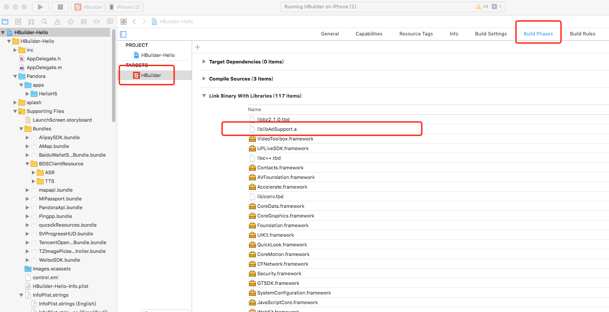


如果需要关闭其他类型的广告可在应用的manifest.json文件中增加如下配置

```
    "plus": {
        "ads": {
            "push":"false",     
            "splash":"false",   
            "rp":"false",        
            "spot":"false",     
        }
    }
```

说明可参考文档 [Manifest.json文档说明 manifest配置](http://ask.dcloud.net.cn/article/94)ads部分

### 如何配置3D Touch
[配置3D Touch](http://ask.dcloud.net.cn/article/425)

### <a id="advertisingIdentifier">**如何配置IDFA** </a>
首先要知道：打开IDFA不影响AppStore审核
如何知道项目中是否使用广告标示符，其实就是查看framework中是否有个叫AdSupport.framework的框架，如果检查工程中没有AdSupport.framework,可能是接入的第三方库里面有,用以下方法检查第三方中是否包含有IDFA版本：

(1)打开终端cd到要检查的文件的目录;
(2)执行命令:grep -r advertisingIdentifier .    (注意别少了点);
[iOS平台配置应用使用广告标识（IDFA）](https://ask.dcloud.net.cn/article/36107)

### 配置国际化
注意离线打包时如果弹出提示框且内容为：“HTML5+ Rumtime D”时，需要在打包的原生工程里配置国际化[如何配置]( https://ask.dcloud.net.cn/article/35963)  


### 配置iOS平台的某些较特殊的功能
[平台功能配置](https://ask.dcloud.net.cn/docs/#//ask.dcloud.net.cn/article/173)